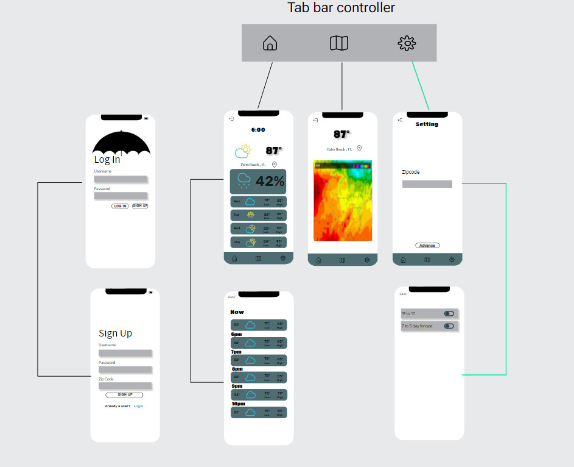

Original App Design Project - README Template
===

# RAINY

## Table of Contents

1. [Overview](#Overview)
2. [Product Spec](#Product-Spec)
3. [Wireframes](#Wireframes)
4. [Schema](#Schema)

## Overview

### Description

[Description of your app]
- A mobile weather app that will allow you to check a detailed forecast of any zipcode, along with supplying a list of simplified forecasts for zipcodes neighboring you

### App Evaluation

[Evaluation of your app across the following attributes]

- **Category: Utilities/Lifestyle**
- **Mobile: This app will be developed exclusively for apple mobile devices**
- **Story: The users will be able to see detailed weather and forecast information for a city of their choice (based on zip code) the user will be also able to scroll through a list of cities and see the weather information and forecast for each city**
- **Market: Any user will be able to use this app**
- **Habit: There is no restrictions for the app usage. The user will be able to access it at any time and change the zip code at any time**
- **Scope: The app will start simple. We want to focus on the app being able to display accurate data for one zip code. Eventually we could expand and a map, a radar and even have live location services**

## Product Spec

### 1. User Stories (Required and Optional)

**Required Must-have Stories**

- [X] Set Up the intitial Xcode project with dependencies  


- [X] Set up the parse server and add the necessary memebers


- [ ] Users can log in
- [ ] Users can sign up
- [ ] Users log out
- [ ] Users can input a zip code
- [ ] Users can see the current weather, forecast, heat index, times
- [ ] User can change the settings change zip, forecast, etc
- [ ] Users can see a list of cities and their forecast

**Optional Nice-to-have Stories**

- [ ] users can search using city names or zip code
- [ ] add a map
- [ ] map tracks the user
- [ ] animated background for detail page

### 2. Screen Archetypes

- Login
  - Users can logIn
  - Users can signUp
  - Users can input a zip code

- Detail
  - Users can see the current weather, forecast, heat index, times
  - Users LogOut

- Stream
  - users can see a list of cities and their forecast

- Settings
  - user can change the settings change zip, forecast, etc

### 3. Navigation

**Tab Navigation** (Tab to Screen)

- Local detailed Weather
- List of major cities and their weather
- Settings

**Flow Navigation** (Screen to Screen)

- Forced Login -> Account creation if log in information is not available.
- Settings -> User will be able to change settings

## Wireframes



### [BONUS] Digital Wireframes & Mockups

### [BONUS] Interactive Prototype

## Schema
### Models
#### User 

   | Property      | Type     | Description |
   | ------------- | -------- | ------------|
   | username      | string   | username to login |
   | password      | string   | password to login |
   | latitude      | Pointer to x-coordinate | x-coordinate of user's zipcode |
   | longitude     | Pointer to y-coordinate | y-coordinate of user's zipcode |

### Networking
#### List of network requests by screen
 - Sign-Up Screen
      - (Create/Post) Create new user using username, password and zipcode
         ```swift
        let user = PFUser()
        user.username = usernameField.text
        user.password = passwordField.text
        user.zipcode = zipcodeField.text
        user.signUpInBackground { (success, error) in
            if success {
                self.performSegue(withIdentifier: "loginSegue", sender: nil)
            } else {
                print("Error:\(error!.localizedDescription)")
            }
        }
         ```
 - Login Screen
      - (Update/PUT) input user information to login
         ```swift
        user.username = usernameField.text!
        user.password = passwordField.text!
        PFUser.logInWithUsername(inBackground: username, password: password) { (user, error) in
            if user != nil {
                self.performSegue(withIdentifier: "loginSegue", sender: nil)
            } else {
                print("Error:\(error!.localizedDescription)")
                
            }
        }
         ``` 
 - Home Screen
      - (Read/GET) Query current forecast of the user's zipcode
      - (Read/GET) Query 5-day local forecast
 - Map Screen
      - (Read/GET) Query weather for local major cities
 - Settings Screen
      - (Update/PUT) Change user's zipcode
        ```swift
        let user = PFUser()
        user.zipcode = zipcode.text
        PFUser.changeZipCode { (success, error) in
        // check if zip code is valid or not
            if success {
                self.performSegue(withIdentifier: "zipCodeChangeSegue", sender: nil)
                // will segue to main screen upon success with forecast of the given zipcode
            } else {
                print("Error, invalid zipcode:\(error!.localizedDescription)")
                // will print an error and allow to enter a correct zip code
            }
        }
         ``` 
      - (Update/PUT) Change preferred degree scale, either Celsius or Fahrenheit

- [OPTIONAL: List endpoints if using existing API such as Yelp]
##### API Of Open Weather
- Base URL - [api.openweathermap.org/data/2.5](api.openweathermap.org/data/2.5)

   HTTP Verb | Endpoint | Description
   ----------|----------|------------
    `GET`    | /forecast?zip=zip code | get 5 day/3-hour forecast based on zip code
    `GET`    | /weather?zip=zip code | get weather data based on zip code
    `GET`    | /weather?units=unit | get different units of measurement 
    
##### API Of Open Weather Maps 1.0
- Base URL - [https://tile.openweathermap.org](https://tile.openweathermap.org)
   
   HTTP Verb | Endpoint | Description
   ----------|----------|------------
    `GET`    | /map     | weather map including precipitation, clouds, pressure, temp, wind based on user's zipcode

##### Open Weather Geocoding API
- Base URL - [http://api.openweathermap.org/geo/1.0](http://api.openweathermap.org/geo/1.0)
 
   HTTP Verb | Endpoint | Description
   ----------|----------|------------
    `GET`    | /zip?zip=zip code | convert zip to longitude and latitude coordinates
